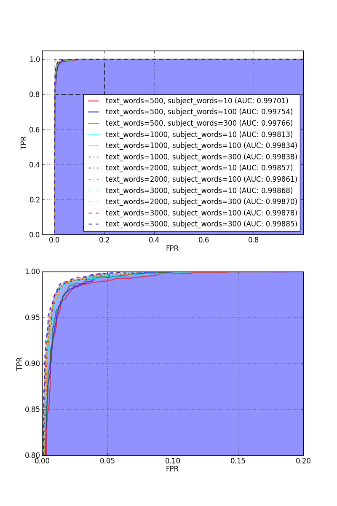

.. include:: coverpage.rst

.. raw:: pdf

    PageBreak oneColumn

.. contents:: Spis treści
   :depth: 2

.. sectnum::
   :depth: 2

.. raw:: pdf

    PageBreak

.. footer::

   .. class:: center

    ###Page###

Wstęp
=====

Poczta elektroniczna jest wynalazkiem bardzo ułatwiającym komunikację
z ludźmi. Pozwala na natychmiastowy kontakt, ze znajomymi, współpracownikami,
nie ponosząc przy tym żadnych kosztów. Ta ostatnia zaleta, łatwo może
być również wykorzystana przez spamerów, czyli osoby rozsyłające
drogą elektroniczną niechciane wiadomości - spam. Wykorzystują oni
wiadomości e-mail między innymi do rozsyłania treści reklamowych.

Istnieje wiele
różnych sposobów obrony przed spamem. Tym któremu poświęcona będzie ta
praca jest stworzenie systemu, zdolnego nauczyć się rozróżniać
wiadomości spamowe od niespamowych. Technologią która
zapewni możliwość uczenia się, będzie uczenie maszynowe.
Stworzony zostanie system, zdolny do rozróżnienia czy
dana wiadomość jest spamem, czy też nie (system ten oczywiście
nie będzie miał stuprocentowej skuteczności). Do nauki wykorzystany
zostanie publicznie dostępny korpus wiadomości e-mail.

W dalszej części tego rozdziału opisane zostaną szczegółowe cele
pracy, przybliżone zostanie pojęcie uczenia maszynowego i narzędzia
z nim związane. Opisana zostanie również budowa filtra antyspamowego
będącego tematem tej pracy.

W drugim rozdziale przedstawiony zostanie
korpus wiadomości jaki był wykorzystywany przy trenowaniu i testowaniu
owego filtra. Przybliżona zostanie struktura wiadomości e-mail, oraz
techniczne szczegóły na które należy zwrócić uwagę przy przetwarzaniu
wiadomości. Opisane zostaną cechy wiadomości według których uczyć
się będzie filtr oraz mechanizmy które cechy te przetworzą, tak
aby skorzystać z nich mogły algorytmy uczenia maszynowego.

W rozdziale trzecim opisane zostaną algorytmy uczenia maszynowego,
oraz efekty ich nauki.
Przedstawione zostaną także mechanizmy związane z ich testowaniem
i wizualizacją efektywności. Znajdzie się tam również zbiorcze
porównanie skuteczności poszczególnych algorytmów.

Rozdział czwarty poświęcony będzie zagadnieniu integracji tworzonego
filtra antyspamowego z klientami poczty elektronicznej. Opisany
zostanie stworzony protokół komunikacji i zademonstrowana zostanie
przykładowa wtyczka dokonująca takiej integracji.

Piąty rozdział poświęcony zostanie podsumowaniu pracy i propozycjom
jej dalszego rozwoju.

Cel pracy
---------

Celem pracy jest stworzenie systemu antyspamowego. Zadaniem systemu
jest:

#. Poprawne wczytanie i przetworzenie dowolnej wiadomości e-mail.
#. Nauka klasyfikacji spamu na podstawie danych treningowych
#. Udostępnienie interfejsu pozwalającego zewnętrznym aplikacjom na
   sklasyfikowanie e-maili.

Przy klasyfikacji system skupiać się będzie przede wszystkim na treści
wiadomości. Informacje takie jak adres nadawcy lub adres serwera,
z którego wiadomość nadeszła nie będą brane pod uwagę.

Uczenie maszynowe
-----------------

Uczenie maszynowe jest dziedziną sztucznej inteligencji. Polega ono
na tworzeniu systemów, które na podstawie przykładów są w stanie uczyć
się, to znaczy zyskiwać wiedzę poprzez gromadzenie doświadczenia. [1]_

..
    Uczenie się systemu oznacza wprowadzenie zmian dotyczących działania
    systemu wraz z napływem nowych informacji. Zmiany te umożliwiają
    bardziej efektywne wykonywanie tych samych lub podobnych zadań
    w przyszłości. [x]_

.. [1] Bolc L., Zaremba P., Wprowadzenie do uczenia się maszyn,
   Akademicka Oficyna Wydawnicza, 1993

Uczenie maszynowe ma szerokie zastosowanie w różnych aspektach
życia, stosuje się je między innymi do:

* rozpoznawania mowy i pisma,
* automatycznego sterowania samochodami,
* klasyfikacji obiektów astronomicznych,
* wykonywania analiz rynkowych.

Wszystkie pomiary wydajności algorytmów, znajdujące się w dalszej części
pracy, zostały wykonane na komputerze o parametrach:

 * Procesor Intel Core i7 (4 rdzenie),
 * 12 GB pamięci RAM.

Biblioteka scikit-learn
-----------------------

Znana również pod nazwami *scikits.learn* i *sklearn*, jest
open-source'ową biblioteką przeznaczoną dla języka programowania
Python. Dostarcza wiele algorytmów uczenia maszynowego do klasyfikacji,
regresji i grupowania danych. Prócz tego biblioteka zawiera również
funkcje pomocnicze służące między innymi do:

 * normalizacji danych,
 * kroswalidacji systemów uczących się,
 * mierzenia efektywności systemów.

Dla algorytmów takich jak regresja logistyczna i
maszyna wsparcia wektorowego *scikit-learn*
wykorzystuje zewnętrzne biblioteki *LIBLINEAR* [2]_ i *LIBSVM* [3]_,
co zapewnia wysoką wydajność obliczeń.

.. [2] http://www.csie.ntu.edu.tw/~cjlin/liblinear/
.. [3] http://www.csie.ntu.edu.tw/~cjlin/libsvm/

Elementy projektu
-----------------

W filtrze antyspamowym będącym tematem tej pracy możemy wyszczególnić
następujące elementy:

Parser wiadomości e-mail
~~~~~~~~~~~~~~~~~~~~~~~~

Podstawową funkcją parsera jest poprawne wczytanie wiadomości
e-mail, w tym celu musi on:

#. Wczytać nagłówki wiadomości.
#. Wczytać ciało wiadomości.
#. Zdekodować ciało wiadomości na podstawie kodowania, i strony
   kodowej znalezionych w nagłówku.
#. Rozpoznać czy ciało wiadomości jest HTMLem i poprawnie go sparsować.

Na parsowanie HTMLa składa się:

#. Przetworzenie ciała do prostego tekstu (plaintext).
#. Podsumowanie liczby i typów tagów użytych w wiadomości.
#. Podliczenie liczby błędów drzewa w wiadomości.

Parser stworzony został w oparciu o moduł *HTMLParser* [4]_ z
biblioteki standardowej języka Python.

.. [4] http://docs.python.org/2/library/htmlparser.html

..
    Sam parser ma postać modułu języka Python. Pozwala to na łatwe
    połączenie go z pozostałymi elementami pracy inżynierskiej.
    Po wczytaniu wiadomości możemy pobrać wszystkie zebrane informacje
    z wewnętrznej obiektowej struktury modułu.

Ekstraktor cech
~~~~~~~~~~~~~~~

Po wczytaniu wiadomości należy przedstawić zawarte w niej informacje
w formie numerycznej. Ekstraktor zajmuje się takimi zadaniami jak:

#. Zliczenie wystąpień słów w temacie wiadomości.
#. Zliczenie wystąpień słów w ciele wiadomości.
#. Zliczenie wystąpień linków i adresów w ciele wiadomości.

Do zliczania słów wykorzystane zostały narzędzia [5]_ pochodzące
z biblioteki *scikit-learn*.

.. [5] http://scikit-learn.org/stable/modules/feature_extraction.html#text-feature-extraction

Klasyfikator
~~~~~~~~~~~~

Jest to moduł odpowiedzialny za utworzenie modelu klasyfikatora wiadomości.
Wykorzystuje on informacje uzyskane z ekstraktora cech.
Znajdują się tutaj funkcje odpowiedzialne za trening oraz
testowanie modelu, a także wykonujące pomiar wydajności poszczególnych
algorytmów.

Serwer HTTP
~~~~~~~~~~~

Zadaniem serwera jest:

#. Nasłuchiwanie żądań HTTP (ang. *Hypertext Transfer Protocol*)
   z wiadomościami nadsyłanych przez programy pocztowe.
#. Sprawdzenie w klasyfikatorze nadesłanej wiadomości.
#. Odesłanie odpowiedzi zawierającej przewidywania klasyfikatora.

Wtyczka do programu pocztowego
~~~~~~~~~~~~~~~~~~~~~~~~~~~~~~

W celu demonstracji możliwości integracji filtra antyspamowego
z klientami poczty,
stworzona została przykładowa wtyczka do programu *Claws Mail* [6]_.

.. [6] http://www.claws-mail.org/

Przetwarzanie wiadomości
========================

Korpus wiadomości
-----------------

W projekcie wykorzystana została baza wiadomości
używana w projekcie *SpamAssasin* [7]_. Znajdujące się
w niej wiadomości pochodzą z różnych źródeł, są to między innymi
publiczne fora, newslettery stron internetowych oraz skrzynki pocztowe
osób zaangażowanych w tworzenie korpusu [8]_. Wśród znajdujących
się w tej bazie e-maili możemy wyróżnić następujące kategorie:

 * **Spam** - wiadomości spamowe, żadne z tych wiadomości nie pochodzą
   z pułapek na spam - to znaczy - zostały wysłane na adresy e-mailowe
   służące do normalnej korespondencji.
 * **Easy Ham** - wiadomości niespamowe, stosunkowe łatwe do odróżnienia
   od spamu, rzadziej wykorzystują HTML i nieczęsto zawierają
   typowo spamowe frazy.
 * **Hard Ham** - wiadomości niespamowe, trudniejsze do odróżnienia od
   spamu, często zawierają błędnie sformatowany HTML, wykorzystują
   frazy spotykane w spamie.

   Tabela 2.1 zawiera informacje na temat liczby wiadomości w
   poszczególnych kategoriach.

.. [7] http://spamassassin.apache.org/
.. [8] http://spamassassin.apache.org/publiccorpus/readme.html

============= =================
Kategoria     Liczba wiadomości
============= =================
Easy Ham      3951
Hard Ham      250
Spam          1896
**Suma**      **6097**
============= =================

.. class:: caption

   **Tab. 2.1.** - Liczba wiadomości poszczególnych
   kategorii znajdujących się w korpusie

Budowa wiadomości e-mail
------------------------

Surowa wiadomość e-mail składa się z dwóch części: nagłówków i
ciała. Części te oddzielone są od siebie sekwencją znaków
``<CR><LF><CR><LF>`` (CR - Carriage Return, LF - Line Feed).

Część nagłówkowa składa z wielu nagłówków w formacie:

| ``Nazwa nagłówka: Wartość nagłówka``

Jeden taki nagłówek może zajmować kilka linijek (każda kolejna
linijka musi się rozpoczynać białymi znakami - spacje lub
tabulacje). Wielkość znaków w nazwie nagłówka nie ma znaczenia.
Listing 2.1 zawiera przykładowy nagłówek.

::

    Return-Path: <bduyisj36648@Email.cz>
    Delivered-To: yyyy@netnoteinc.com
    Received: from tugo (unknown [211.115.78.51]) by mail.netnoteinc.com
        (Postfix) with ESMTP id F40CA1140BA; Fri,  6 Jul 2001 02:03:10 +0000
        (Eire)
    Received: from 127.0.0.1 ([202.72.66.134]) by tugo with Microsoft
        SMTPSVC(5.0.2172.1); Fri, 6 Jul 2001 11:00:31 +0900
    Message-Id: <Mp9U4NEPd9mpa.8zI7m9NaCf4dlKT-HBhxaL@127.0.0.1>
    From: bduyisj36648@Email.cz <bduyisj36648@Email.cz>
    Subject: Finally   collecct   your   judgment (71733)
    Date: Wed, 16 Aug 2000 17:38:13 -0400 (EDT)
    MIME-Version: 1.0
    Content-Transfer-Encoding: 7bit
    X-Originalarrivaltime: 06 Jul 2001 02:00:32.0843 (UTC) FILETIME=[708F81B0:
        01C105BF]
    To: undisclosed-recipients:;

.. class:: caption

   **Lis. 2.1.** - Przykładowy nagłówek wiadomości e-mail

Ciało wiadomości to właściwa zawartość e-maila. Może być ono zapisane
zarówno w języku znaczników jakim jest HTML, jak również jako
zwykły tekst. Ponadto ciało zapisane jest w konkretnej stronie kodowej.
Może również być dodatkowo zakodowane kodowaniem ``quoted-printable``.

Ważne nagłówki
--------------

Content-Type
~~~~~~~~~~~~

Jedną z podstawowych informacji jaką zawiera ten nagłówek jest typ
ciała wiadomości. Najczęściej wykorzystywane są tu:

* ``text/plain`` - wiadomość zapisana prostym tekstem,
* ``text/html`` - wiadomość zapisana z użyciem HTML.

E-maile często jednak nie zawierają tych informacji lub celowo
opisują je w sposób mylący. Z tego powodu parser nie polega na tej
informacji i sam stara się wykryć czy wiadomość zawiera HTML,
czy też nie.

Spotyka się również maile wieloczęściowe, przykładowo kiedy w mailu
zamieszczone są obrazki lub inne załączniki, albo kiedy mail
posiada swoją wersję zarówno w HTMLu i prostym tekście.
Wówczas ciało wiadomości podzielone jest na części ciągiem znaków
zwanym ``boundary`` (granica). Wówczas każda z części posiada
swoje własne nagłówki i ciało.

Inną ważną informacją zawartą w tym nagłówku jest deklaracja strony
kodowej, w której zapisane zostało ciało. Na podstawie
tej informacji parser dekoduje tekst wiadomości na swój
wewnętrzny format.

Listing 2.2 zawiera przykłady użycia tego nagłówka.

::

    Content-Type: text/html;
    Content-Type: text/html;	charset=iso-8859-1
    Content-Type: text/html; charset="CHINESEBIG5"
    Content-Type: text/html; charset="ISO-8859-1"
    Content-Type: text/html; charset="US-ASCII"
    Content-Type: text/html; charset="Windows-1251"
    Content-Type: text/html; charset="euc-kr"
    Content-Type: text/html; charset="gb2312"
    Content-Type: text/html; charset="ks_c_5601-1987"
    Content-Type: text/html; charset="us-ascii"
    Content-Type: text/html;;;;;;;;;;;;;;;;;;;;;;;;;;;;;;;;;;;;; (...)
    Content-Type: text/html;charset=ks_c_5601-1987
    Content-Type: text/plain;
    Content-Type: text/plain; Charset = "us-ascii"
    Content-Type: text/plain; charset="DEFAULT"
    Content-Type: text/plain; charset="DEFAULT_CHARSET"
    Content-Type: text/plain; charset="GB2312"
    Content-Type: multipart/alternative; boundary="----=_NextPart_000_81109_01C25FF9.832EE820"
    Content-Type: multipart/mixed; boundary="=_NextPart_Caramail_0190361032516937_ID"

.. class:: caption

   **Lis. 2.2.** - Przykłady wykorzystania nagłówka ``Content-Type``

Content-Transfer-Encoding
~~~~~~~~~~~~~~~~~~~~~~~~~

Nagłówek ten opisuje jak zakodowane są dane w ciele wiadomości.
W przypadku wiadomości e-mail można spodziewać kodowań:

* ``7bit`` - dane tekstowe zakodowane tylko na 7 bitach (ASCII).
* ``8bit`` - dane tekstowe zakodowane na 8 bitach (inne strony kodowe).
* ``quoted-printable`` - dane zakodowane kodowaniem ``quoted-printable``
* ``base64`` - dane zakodowane za pomocą ``base64``

Listing 2.3 zawiera przykłady wykorzystania tego nagłówka.

::

    Content-Transfer-Encoding: 7BIT
    Content-Transfer-Encoding: 8bit
    Content-Transfer-Encoding: QUOTED-PRINTABLE
    Content-Transfer-Encoding: base64

.. class:: caption

   **Lis. 2.3.** - Przykłady wykorzystania
   nagłówka ``Content-Transfer-Encoding``

Subject
~~~~~~~

W nagłówku tym zapisany jest temat wiadomości. Domyślnie nagłówek
ten zawiera tylko znaki ASCII. Jednak tutaj podobnie
jak w ciele wiadomości spotkać się możemy z różnymi stronami kodowymi i
kodowaniami. Jeśli nagłówek jest dodatkowo zakodowany przyjmuje
on postać:

|    ``=?strona_kodowa?kodowanie?zakodowany_temat?=``

* ``strona_kodowa`` to nazwa strony kodowej, w jakiej zapisany jest temat,
* ``kodowanie`` to litera ``Q`` lub ``B``, wskazuje to typ użytego kodowania,
  ``Q`` to ``quoted-printable``, ``B`` to ``base64``,
* ``zakodowany_temat`` to zakodowany temat wiadomości.

W celu odczytania takiego tematu najpierw dekodujemy ``zakodowany_temat``
używając właściwego kodowania, a na końcu odczytujemy go przy pomocy
podanej strony kodowej.

::

    Subject: Your eBay account is about to expire!
    Subject: re: domain registration savings
    Subject: Make a Fortune On eBay                         24772
    Subject: Save $30k even if you've refi'd           1090
    Subject: =?Big5?B?rEKq96SjrE5+fqdPtsykRn5+?=
    Subject: =?GB2312?B?NTDUqrvxtcPSu9LazuXHp83yRU1BSUy12Na3tcS7+rvh?=
    Subject: =?GB2312?B?0rvN+KGwu92hsczsz8KjrNK71bnM7M/C1qotLS0tMjAwM8TqNNTCMcjVLS00?=

.. class:: caption

   **Lis. 2.4.** - Przykłady wykorzystania nagłówka ``Subject``

W listingu 2.4 widzimy, że
w końcówkach niektórych tematów pojawiają się dodatkowe
nieznaczące znaki. Jest to technika używana przez spamerów mająca
na celu zmylenie prostych filtrów antyspamowych, które sprawdzają
czy dana wiadomość jest spamem bądź na podstawie prostego porównania
tematu wiadomości z zebraną wcześniej bazą spamu.

Dekodowanie ciała wiadomości
----------------------------

W wiadomościach e-mail spotykamy się z dwoma różnorodnymi kodowaniami
(nie liczymy tutaj kodowań podstawowych ``7bit`` i ``8bit``).
Jedno z nich to ``quoted-printable``. Jest to stosunkowo proste kodowanie,
które zapisuje bajty o wartości większej od 127, bajty będące kodami sterującymi
ASCII oraz znak ``=`` zapisując każdy z tych bajtów jako wartość
szesnastkową poprzedzoną znakiem ``=``. Ponieważ zakodowane są tylko
pojedyncze znaki kodowanie to jest proste do zdekodowania.

W listingu 2.5 zamieszczono fragment ciała wiadomości
zakodowanego z wykorzystaniem ``quoted-printable``.

::

    <html><body>

    <table bgcolor=3D"663399" border=3D"2" width=3D"999" cellspacing=3D"0" cel=
    lpadding=3D"0">
      <tr>
        <td colspan=3D"3" width=3D"999"> 
 
    

     
     
<b>Get 12 FREE VHS or DVDs! </b> 
    <table bgcolor=3D"white" border=3D"2" width=3D"500">

.. class:: caption

   **Lis. 2.5.** - Fragment ciała wiadomości e-mail zakodowany przy
   użyciu ``quoted-printable``

Drugim spotykanym kodowaniem jest ``base64``. Jest to inny rodzaj kodowania,
koduje się za jego pomocą już nie pojedyncze znaki a cały blok danych.
W niektórych wiadomościach zdarza się spotkać z sytuacją kiedy tylko
początek ciała jest zakodowany jako ``base64``, natomiast reszta tekstu
zapisana jest prostym tekstem. Z tego powodu do wyznaczenia
części wiadomości, która jest zakodowana wykorzystane zostało
wyrażenie regularne, które dopasowywane jest do ciała:

| ``RE_BASE64 = re.compile('(?:(?:[a-zA-Z0-9+/=]+)[\n]?)+')``

Tekst "Ala ma kota" zapisany w ``base64`` wygląda następująco:

| ``QWxhIG1hIGtvdGE=``

Aby wiadomość mogła być prawidłowo wyświetlona musi zostać ona wczytana
przy pomocy odpowiedniej strony kodowej. Strona kodowa jakiej potrzebujemy
zadeklarowana jest w nagłówku ``Content-Type`` jako ``charset``.
Przy przetwarzaniu tekstu może się zdarzyć sytuacja, że bajt, który
przetwarzamy nie został przewidziany w stronie kodowej. W takim przypadku
bajt taki jest ignorowany.

Przetwarzanie HTML
------------------

Jeśli ciało wiadomości zostanie rozpoznane jako HTML zostaje podjęta
akcja parsowania go. Proste podejście do tego problemu (czyli zbudowanie
drzewa tagów) nie jest tutaj skuteczne. Powodem tego jest ogromna liczba
błędów występujących w mailach. Najczęściej spotykane to:

* brak domknięć części otwartych tagów,
* "zakleszczanie" tagów (np. ``<b><i>Tekst</b></i>``),
* brak elementu ``<html>`` w dokumencie.

Z tego powodu wykorzystany został parser, który wczytuje kolejne
otwarcia tagów, prosty tekst między nimi i zamknięcia tagów.
Na podstawie napotkanych otwarć i zamknięć tworzy on stos tagów,
ignoruje jednak przy tym wszelkie niewłaściwe domknięcia (zapisuje
jednak ich liczbę). Zwykły tekst pomiędzy tagami zostaje zapisany do bufora
z prostym tekstem.

Prócz ekstrakcji tekstu z dokumentu HTML powyższy parser zbiera również
statystyki na temat pokrycia tekstu przez tagi (np. ile liter w dokumencie
było obłożone tagami pogrubienia), oraz zlicza liczbę błędów napotkanych
przy przetwarzaniu struktury HTML.

Wiadomości wieloczęściowe
-------------------------

Jak już wcześniej wspomniano niektóre wiadomości mają formę wieloczęściową.
Takie e-maile rozpoznajemy po typie ``multipart/`` zawartym w nagłówku
``Content-Type``. Wówczas nagłówek ten zawiera również wartość ``boundary``,
która posłuży do podzielenia wiadomości. Przykładowo jeśli nasze ``boundary``
przyjmuje wartość ``QWERTY`` to separatory jakich szukamy w dokumencie
mają wartość ``--QWERTY``. Wyjątkiem jest tu ostatni separator,
jego wartość to ``--QWERTY--``. Wszystkie informacje zawarte przed
pierwszym i za ostatnim separatorem zostają zignorowane.

Następnie wszystkie znalezione w ten sposób części wiadomości zostają
ponownie sparsowane (traktowane są jako osobne wiadomości) a następnie
ponownie zebrane w całość (teksty zostają połączone, a statystyki
zsumowane).

Może się również zdarzyć sytuacja, że część wiadomości również
jest wiadomością wieloczęściową. Z tego powodu wykorzystane zostało
rozwiązanie rekurencyjne, które łatwo radzi sobie z takim
problemem.

Listing 2.6 zawiera przykładową wiadomość wieloczęściową.
Wartość ``boundary`` dla niej to ``BoundaryOfDocument``.

::

    This is a multi-part message in MIME format.

    --BoundaryOfDocument
    Content-Type: text/plain
    Content-Transfer-Encoding: 7bit

    FREE CD-ROM LESSONS
    http://isis.webstakes.com/play/Isis?ID=89801

    1. Choose from 15 titles
    2. Learn new skills in 1 hour
    3. Compare at $59.95
    4. Quick, easy and FREE!

    (...)

    --BoundaryOfDocument
    Content-Type: text/html
    Content-Transfer-Encoding: 7bit

    <META HTTP-EQUIV="Content-Type" CONTENT="text/html;charset=iso-8859-1">
    <!DOCTYPE HTML PUBLIC "-//W3C//DTD HTML 4.0 Transitional//EN">
    <HTML><HEAD><TITLE>Untitled Document</TITLE>
    <META content="text/html; charset=iso-8859-1" http-equiv=Content-Type>
    </HEAD>
    <BODY bgColor=#ffffff>

    <TABLE align=center border=0 cellPadding=0 cellSpacing=0 width=500>

    (...)

    --BoundaryOfDocument--

.. class:: caption

   **Lis. 2.6.** - Przykładowa wiadomość wieloczęściowa.

Istotne cechy wiadomości
------------------------

Najważniejszym krokiem podczas tworzenia systemu
antyspamowego było pobranie odpowiednich cech z wiadomości.
Informacje zawarte w wiadomości, na które zwracamy uwagę
to przede wszystkim temat wiadomości i jej treść.
Innymi ważnymi cechami jest pokrycie tekstu wiadomości
tagami wyróżniającymi. Ma to na celu zwrócenie szczególnej
uwagi na wiadomości gdzie spora część tekstu miała
na celu przykucie uwagi odbiorcy.

Algorytmy uczenia maszynowego wymagają, aby ich dane wejściowe
były danymi numerycznymi. Nie jest to problemem dla danych,
takich jak liczba użytych tagów, czy procentowe pokrycie
tekstu danym tagiem. Jednakże, danych tekstowych nie możemy
przekazać do algorytmów w bezpośredniej formie. W tym celu
zamieniamy je na dane numeryczne, proces ten zwany jest
wektoryzacją. Polega on
na zliczeniu wystąpień najczęściej występujących ``N``
słów, we wszystkich przetwarzanych e-mailach. Efektem takiego
działania będzie macierz o wymiarze :math:`M \times N`, gdzie
:math:`M` jest liczbą przetwarzanych tekstów. Macierz ta
będzie macierzą rzadką. Wartość :math:`N`, będąca liczbą
najpopularniejszych słów jakie chcemy zliczyć, była dobierana
eksperymentalnie, testowane były różne warianty.  
Wektoryzacja ta została zastosowana do przetworzenia tematów
wiadomości.

Do przetworzenia ciał wiadomości zastosowana
została inna forma zliczania słów, mianowicie TF-IDF
(ang. TF - term frequency, IDF - inverse document frequency).
Użycie tej techniki sprawia, że mniejsza waga zostaje
przypisana do słów popularnych w wielu wiadomościach,
np. przyimków [9]_. Podobnie jak przy wektoryzacji
zliczającej słowa, tutaj także liczba najpopularniejszych
słów - :math:`N` - była wybierana eksperymentalnie.

Z wiadomości pobrano następujące cechy:

 * ``body_length`` - długość tekstu wiadomości (w znakach),
 * ``tags_count`` - liczba otwarć tagów HTML,
 * ``errors_count`` - liczba błędnie zamkniętych tagów HTML,
 * ``cov_b`` - pokrycie tekstu tagiem ``<b>``
 * ``cov_i`` - pokrycie tekstu tagiem ``<i>``
 * ``cov_font`` - pokrycie tekstu tagiem ````
 * ``cov_center`` - pokrycie tekstu tagiem ``
``
 * ``http_links`` - liczba linków HTTP w wiadomości
 * ``http_raw_links`` - liczba linków HTTP w wiadomości, których
   adres jest podany jako IP,
 * ``mail_links`` - liczba linków mailowych w wiadomości
 * ``attached_images`` - liczba obrazków dołączony do wiadomości
 * ``charset_errors`` - wartość logiczna, oznacza występowanie
   błędów odczytu wiadomości w zadeklarowanej przez nią stronie
   kodowej,
 * zwektoryzowany temat wiadomości,
 * zwektoryzowana treść wiadomości.

Część cech zostało wyznaczonych w stosunku do długości tekstu
wiadomości:

 * ``rel_tags_count`` - stosunek ``tags_count`` do ``body_length``,
 * ``rel_errors_count`` - stosunek ``errors_count`` do ``body_length``,
 * ``rel_cov_b`` - stosunek ``cov_b`` do ``body_length``,
 * ``rel_cov_i`` - stosunek ``cov_i`` do ``body_length``,
 * ``rel_cov_font`` - stosunek ``cov_font`` do ``body_length``,
 * ``rel_cov_center`` - stosunek ``cov_center`` do ``body_length``,
 * ``rel_http_links`` - stosunek ``http_links`` do ``body_length``,
 * ``rel_http_raw_links`` - stosunek ``http_raw_links`` do ``body_length``,
 * ``rel_mail_links`` - stosunek ``mail_links`` do ``body_length``.

Przykładową listę cech zamieszczono w listingu 2.7.

::

    body_length                                                1402
    tags_count                                                   93
    errors_count                                                 10
    cov_b                                                       829
    cov_i                                                        48
    cov_font                                                   1315
    cov_center                                                    0
    http_links                                                    2
    http_raw_links                                                0
    mail_links                                                    2
    attached_images                                               0
    charset_errors                                                0
    rel_tags_count                                       0.06633381
    rel_errors_count                                    0.007132668
    rel_cov_b                                             0.5912982
    rel_cov_i                                             0.0342368
    rel_cov_font                                          0.9379458
    rel_cov_center                                                0
    rel_http_links                                      0.001426534
    rel_http_raw_links                                            0
    rel_mail_links                                      0.001426534

.. class:: caption

   **Lis. 2.7.** - Lista cech przykładowej wiadomości (nie zawarto
   cech uzyskanych poprzez wektoryzację tematu i tekstu
   wiadomości)

.. [9] Manning, C. D.; Raghavan, P.; Schutze, H. (2008).
   "Scoring, term weighting, and the vector space model"

Przygotowanie danych wejściowych dla klasyfikatorów
---------------------------------------------------

W uczeniu maszynowym, często stosuje się normalizację danych
wejściowych. Ma to celu zwiększenie skuteczności działania systemów
uczących się. W tym przypadku zastosowano skalowanie wartości
cech do zakresu ``[0, 1]``. Typ i zakres normalizacji został
wybrany ze względu na to, że produktem procesu wektoryzacji tekstu
są macierze rzadkie, z wartościami nie mniejszymi niż 0.
Taki proces normalizacji nie zaburzy rzadkości macierzy,
co z kolei ułatwi przetrzymywanie takiej macierzy w pamięci
operacyjnej.

Algorytmy uczenia maszynowego
=============================

Kroswalidacja
-------------

W celu uzyskania miarodajnych wyników podczas testowania algorytmów
uczenia maszynowego, wszystkie pomiary wydajności należy wykonywać
na innym zestawie danych, niż te użyte do treningu. W tym celu, korpus
wiadomości został podzielony na zestaw treningowy i zestaw testowy
według poniższych reguł:

#. Cały korpus zostaje podzielony na :math:`k` równych części, przy
   czym w każdej części proporcja wiadomości spamowych i niespamowych
   jest taka sama.
#. Walidacja zostaje wykonana :math:`k` razy.
#. W każdej walidacji :math:`k - 1` części zostaje wykorzystanych jako
   dane treningowe, a pozostała część jako dane testowe.
#. Wyniki powyższych walidacji zostają uśrednione.

Krzywa ROC
----------

Krzywa ROC (ang. *receiver operator characteristic*) jest techniką wizualizacji
wydajności klasyfikatora. Technika ta wykorzystywana jest głównie
w teorii detekcji sygnałów,
znalazła zastosowanie również w uczeniu maszynowym. Krzywa taka opisuje
trafność klasyfikacji w zależności od progu decyzyjnego. Tworzona jest
poprzez wyznaczanie liczby przykładów, które zostały poprawnie zakwalifikowane
jako należące do rozważanej klasy (TPR, ang. *true positive rate*) oraz
liczby przykładów, które zostały błędnie zakwalifikowane jako należące do klasy
(FPR, ang. *false positive rate*) dla różnych progów decyzyjnych.

W celu uzyskania skalarnej miary wydajności liczone jest pole pod krzywą,
miara taka nosi nazwę AUC (ang. *Area Under Curve*). Im większa wartość
AUC, tym lepszy wynik osiągnięty przez klasyfikator.

Dobór parametrów wektoryzacji
-----------------------------

Jak wspomniano wcześniej, ilość najpopularniejszych słów branych pod uwagę,
w temacie wiadomości i jej tekście, została wybrana eksperymentalnie.
Do testów wykorzystano regresję logistyczną o domyślnych parametrach
(więcej o tym algorytmie w dalszej części tego rozdziału). Wyniki
pomiarów zamieszczono w tabeli 3.1 i rysunku 3.1. W dalszej części
pracy zdecydowano się wykorzystać parametry:
``text_words=2000, subject_words=300``. Przy tych parametrach
osiągnięto wysoką wydajność, natomiast dalsze zwiększanie wartości tych
parametrów powodowałoby wydłużenie czasów treningu systemu i klasyfikacji
wiadomości.

=================================== ==================== ======================
Parametry                           Średnie AUC          Odchylenie standardowe
=================================== ==================== ======================
text_words=500, subject_words=10    0.99701              0.00052
text_words=500, subject_words=100   0.99754              0.00054
text_words=500, subject_words=300   0.99766              0.00054
text_words=1000, subject_words=10   0.99813              0.00055
text_words=1000, subject_words=100  0.99834              0.00053
text_words=1000, subject_words=300  0.99838              0.00052
text_words=2000, subject_words=10   0.99857              0.00054
text_words=2000, subject_words=100  0.99861              0.00062
text_words=3000, subject_words=10   0.99868              0.00045
text_words=2000, subject_words=300  0.99870              0.00056
text_words=3000, subject_words=100  0.99878              0.00053
text_words=3000, subject_words=300  0.99885              0.00051
=================================== ==================== ======================

.. class:: caption

   **Tab. 3.1.** - Wyniki kroswalidacji dla doboru paramerów wektoryzacji;
   parametr ``text_words`` oznacza liczbę słów w tekście wiadomości,
   natomiast ``subject_words`` - liczbę słów w temacie wiadomości

.. class:: caption

   **Rys. 3.1.** - Krzywe ROC kroswalidacji dla wyboru parametrów
   wektoryzacji

Regresja logistyczna
--------------------

Regresja logistyczna jest uogólnionym modelem liniowym klasyfikacji danych.
Dzięki wykorzystaniu funkcji logistycznej wartość przewidywana przez
ten model zawiera się w przedziale :math:`0 \leq p \leq 1` [10]_.

Jednym z parametrów regresji logistycznej jakim możemy manipulować
jest ``C``, parametr ten odpowiedzialny jest za regularyzację.
Regularyzacja ma na celu zapobieganie sytuacji w której algorytm
nadmiernie dopasuje (ang *overfitting*) się do danych treningowych,
co obniży jego efektywność dla danych testowych [10]_. Im mniejsza
wartość ``C``, tym regularyzacja będzie silniejsza.

Tabela 3.2 i rysunek 3.2 przedstawiają wyniki kroswalidacji
dla regresji logistycznej, z użyciem różnych wartości parametru ``C``.
Z wyników tych możemy wywnioskować, że optymalna wartość ``C``
zawiera się wa zakresie ``[3.5, 7.5]``.
Przeciętny czas treningu wyniósł 30 sekund.

================================= ====================== ======================
Parametry                         Średnie AUC            Odchylenie standardowe
================================= ====================== ======================
C=0.1                               0.99748              0.00059
C=0.5                               0.99852              0.00056
C=1                                 0.99870              0.00055
C=1.5                               0.99877              0.00058
C=3.5                               0.99882              0.00059
C=7.5                               0.99882              0.00060
C=5                                 0.99883              0.00060
================================= ====================== ======================

.. class:: caption

   **Tab. 3.2.** - Wyniki kroswalidacji dla regresji logistycznej

.. class:: caption

   **Rys. 3.2.** - Krzywe ROC dla regresji logistycznej

.. [10] Trevor Hastie, Robert Tibshirani, Jerome Friedman,
   The Elements of Statistical Learning, 2009

Naiwny klasyfikator bayesowski
------------------------------

Klasyfikator bayesowski jest techniką uczenia maszynowego
stosującą twierdzenie Bayesa do przetwarzanych danych.
Nazywa się go naiwnym, ponieważ zakładamy, że wszystkie
przetwarzane cechy są od siebie niezależne. Mimo, że
założenie to zwykle nie jest spełnione, algorytm
wciąż jest skuteczny [10]_.

Parametrem jaki kontrolujemy jest tutaj wygładzanie
Laplace'a - ``alpha``. Wyniki kroswalidacji znajdują się
w tabeli 3.3 i na rysunku 3.3. Średni czas treningu wynosił
25 sekund.

================================= ====================== ======================
Parametry                         Średnie AUC            Odchylenie standardowe
================================= ====================== ======================
alpha=0.001                         0.99581              0.00154
alpha=1                             0.99598              0.00102
alpha=0.5                           0.99624              0.00092
alpha=0.01                          0.99653              0.00090
alpha=0.1                           0.99655              0.00086
================================= ====================== ======================

.. class:: caption

   **Rys. 3.2.** - Wyniki kroswalidacji dla naiwnego klasyfikatora
   bayesowskiego

.. class:: caption

   **Rys. 3.2.** - Krzywe ROC dla naiwnego klasyfikatora
   bayesowskiego

Maszyna wsparcia wektorowego
----------------------------

Podobnie jak regresja logistyczna, maszyna wsparcia wektorowego
(ang. SVM - *Support Vector Machine*)
jest uogólnionym modelem liniowym klasyfikacji. SVM reprezentuje
dane jako punkty w przestrzeni (wymiar tej przestrzeni jest
równy liczbie cech danych wejściowych). Celem algorytmu
jest rozdzielenie przykładów należących do różnych kategorii,
za pomocą hiperpłaszczyzny, będącej w największym możliwym
odstępie od punktów które oddziela (przykład takiego
podziału znajduje się na rysunku 3.3). Ponadto, dzięki
zastosowaniu funkcji jąder, SVM może zostać zastosowany
do nieliniowej klasyfikacji [10]_.

Przetestowane zostały dwie wersje SVM:

 * liniowy SVM (bez funkcji jądra); wyniki w tabeli 3.3 i
   na rysunku 3.4,
 * SVM z jądrem RBF (ang. *Radial Basis Function*), parametrem
   funkcji jądra jest ``sigma``; wyniki w tabeli 3.4 i
   na rysunku 3.5.

Podobnie jak regresji logistycznej, parametrem jest
tu ``C``, odpowiedzialne za regularyzacje. Ze względu na długi
czas obliczeń, zdecydowano się zmniejszyć parametry wektoryzacji,
zastosowano: ``text_words=500, subject_words=50``. Przeciętny
czas treningu wyniósł:

 * 2.2 minuty dla SVM z jądrem RBF,
 * 1.2 minuty dla liniowego SVM.

================================= ====================== ======================
Parametry                         Średnie AUC            Odchylenie standardowe
================================= ====================== ======================
C=3.5                               0.99500              0.00059
C=1.5                               0.99603              0.00050
C=1                                 0.99639              0.00046
C=0.1                               0.99673              0.00074
C=0.5                               0.99677              0.00043
================================= ====================== ======================

.. class:: caption

   **Tab. 3.3.** - Wyniki kroswalidacji dla liniowego SVM

================================= ====================== ======================
Parametry                         Średnie AUC            Odchylenie standardowe
================================= ====================== ======================
gamma=0.01, C=0.1                   0.97849              0.00334
gamma=0.01, C=0.5                   0.99052              0.00154
gamma=0.1, C=0.1                    0.99224              0.00129
gamma=0.01, C=1                     0.99418              0.00101
gamma=0.01, C=1.5                   0.99524              0.00074
gamma=0.01, C=3.5                   0.99622              0.00037
gamma=0.1, C=0.5                    0.99647              0.00038
gamma=0.1, C=1                      0.99679              0.00026
gamma=0.1, C=3.5                    0.99698              0.00060
gamma=0.1, C=1.5                    0.99700              0.00032
================================= ====================== ======================

.. class:: caption

   **Tab. 3.4.** - Wyniki kroswalidacji dla SVM z jądrem RBF

.. class:: caption

   **Rys. 3.3.** - Przykład rodzielenia dwóch kategorii danych
   przez SVM (Źródło: Wikipedia)

.. class:: caption

   **Rys. 3.4.** - Krzywe ROC dla liniowego SVM

.. class:: caption

   **Rys. 3.5.** - Krzywe ROC dla SVM z jądrem RBF

Las drzew losowych
------------------

Las drzew losowych jest metodą zespołowego uczenia. Polega
ona na wytrenowaniu wielu prostych, prawdopodobnie słabo
przystosowanych klasyfikatorów i połączenia ich w jeden
klasyfikator. W przypadku Lasu drzew losowych, jako
pomniejsze klasyfikatory wykorzystywane są drzewa decyzyjne.
Świetnie nadają się do tego zadania, ze względu na ich
możliwość uczenia się skomplikowanych relacji między cechami [10]_.

W przypadku lasów losowych możemy decydować z ilu drzew
składać się będzie las, odpowiedzialny jest za to parametr
``n_estimators``. Efektywność lasów, w zależności
od liczby drzew przedstawiono w tabeli 3.5 i na rysunku 3.6.

Wartą odnotowania zaletą drzew losowych jest fakt, że zarówno
trening, jak i późniejsza klasyfikacja, mogą zostać zrównoleglone.
Może to znacząco poprawić szybkość działania na maszynach
wielordzeniowych i klastrach obliczeniowych. Czas treningu,
zależnie od liczby użytych drzew, wynosił od 23 do 35 sekund.

================================= ====================== ======================
Parametry                         Średnie AUC            Odchylenie standardowe
================================= ====================== ======================
n_estimators=10                     0.99465              0.00239
n_estimators=30                     0.99704              0.00103
n_estimators=50                     0.99724              0.00086
n_estimators=75                     0.99743              0.00077
n_estimators=100                    0.99765              0.00049
================================= ====================== ======================

.. class:: caption

   **Tab. 3.5.** - Wyniki kroswalidacji dla lasów drzew losowych

.. class:: caption

   **Rys. 3.6.** - Krzywa ROC dla lasu drzew losowych

Porównanie efektywności klasyfikatorów
--------------------------------------

Najlepszy rezultat, wśród porównywanych algorytmów, uzyskała regresja
logistyczna. Pozostałe algorytmy uzyskały zbliżone do siebie wyniki.
Lepszy wynik mogłaby uzyskać maszyna wsparcia wektorowego, jednakże,
ze względu na długi czas obliczeń, algorytm ten pracował na mniejszej
ilości danych (zmniejszenie parametrów wektoryzacji tekstu). Szczegółowe
porównanie znajduje się w tabeli 3.x i na rysunku 3.x.

======================= ================== ================== ======================
Algorytm                Parametry          Średnie AUC        Odchylenie standardowe
======================= ================== ================== ======================
Regresja logistyczna    C=5                  0.99883          0.00060
Naiwny klas. bayesowski alpha=0.1            0.99655          0.00086
SVM (liniowy)           C=0.5                0.99677          0.00043
SVM (RBF)               gamma=0.1, C=1.5     0.99700          0.00032
Las drzew losowych      n_estimators=100     0.99765          0.00049
======================= ================== ================== ======================

.. class:: caption

   **Tab. 3.6.** - Porównawczy wynik wszystkich testowanych algorytmów

.. image:: charts/ROC_ALL.png
   :width: 85%
   :align: center

.. class:: caption

   **Rys. 3.7.** - Zbiór krzywych ROC poszczególnych algorytmów

Integracja z programem pocztowym
================================

Protokół komunikacji
--------------------

Założeniem projektu jest umożliwienie dowolnemu klientowi poczty
na korzystanie z filtra antyspamowego. W tym celu zastosowano
komunikację bazującą na protokole sieciowym, a dokładniej
protokole HTTP. Klient chcąc sprawdzić czy dana wiadomość jest
spamem, wysyła ją do serwera HTTP filtra antyspamowego, a w odpowiedzi
otrzymuje wartość logiczną (prawda lub fałsz) mówiącą, czy wiadomość
została uznana za spam.

Serwer działa na porcie ``2220``. Oczekuje na wiadomości w formie
surowej, wysłane z użyciem metody ``PUT`` [11]_ protokołu HTTP.
Po otrzymaniu takiej wiadomości serwer podejmuje następujące
działania:

#. Parsuje surową wiadomość korzystając z opisanego wcześniej
   parsera wiadomości.
#. Przekazuje sparsowaną wiadomość do ekstraktora cech.
#. Dane otrzymane z ekstraktora cech zostają przekazane do
   wytrenowanego wcześniej algorytmu uczenia maszynowego.
#. Jeśli algorytm uzna wiadomość za spam, serwer zwróci
   pustą odpowiedź z kodem HTTP ``221``, w przeciwnym wypadku
   zwróci pustą odpowiedź z kodem ``220``.

.. [11] http://www.w3.org/Protocols/rfc2616/rfc2616-sec9.html
   Sekcja 9.6.

Wtyczka do klienta poczty
-------------------------

*Claws Mail* jest prostym klientem poczty elektronicznej przeznaczonym
zarówno na systemy operacyjne z rodziny Windows jaki i Unix.

Został on wykorzystany w tej pracy, ze względu na możliwość wykonywania
przez niego skryptów języka Python. Skrypt taki w trakcie wykonania
uzyskuje dostęp do okna programu i znajdujących się w nim
wiadomości i folderów. Z użyciem tego mechanizmu wykonana została integracja
klienta poczty z filtrem antyspamowym (a dokładniej jego serwerem HTTP).
Po uruchomieniu skrypt wykonuje następujące kroki:

#. W API klienta uzyskuje dostęp do aktualnie wybranego folderu i znajduje
   w nim wszystkie nieprzeczytane wiadomości.
#. Dla każdej nieprzeczytanej wiadomości odczytany zostaje plik zawierający
   e-mail w postaci surowej.
#. Każda surowa wiadomość zostaje wysłana osobno, za pomocą protokołu HTTP,
   metodą ``PUT``, na adres ``127.0.0.1``, port ``2220``.
#. Skrypt oczekuje na odpowiedź od serwera, jeśli w odpowiedzi otrzyma
   kod HTTP ``221`` wiadomość zostaje uznana za spam i przeniesiona do
   folderu "Kosz".
#. Po sprawdzeniu wszystkich wiadomości wyświetlone zostaje podsumowanie o
   liczbie wiadomości, które zostały rozpoznane jako spam.

Uruchomienie i efekt działania skryptu widoczne są na rysunkach 5.1 i 5.2.

.. image:: images/plugin1_c.png
   :width: 85%
   :align: center

.. class:: caption

   **Rys. 4.1.** - Wywołanie skryptu sprawdzającego wiadomości e-mail

.. class:: caption

   **Rys. 4.2.** - Efekt działania skryptu sprawdzającego wiadomości e-mail

Podsumowanie i możliwości rozbudowy
===================================

Efektem pracy jest kompletny system filtra antyspamowego. Udało się stworzyć
filtr skutecznie wykrywający wiadomości spamowe. Filtr obserwuje
takie cechy wiadomości jak użyte słowa, czy procentowe pokrycie tekstu
tagami HTML. Najskuteczniejszym z testowanych algorytmów,
przy cechach wiadomości wybranych w tej pracy, okazała się
regresja logistyczna.

Oprócz samego klasyfikatora, stworzone zostały narzędzia wspomagające
pracę filtra. Jednym z tych narzędzi jest parser surowych wiadomości
e-mail. Potrafi on skutecznie przetwarzać wiadomości wieloczęściowe,
korzystające z HTML, zakodowane różnymi kodowaniami, zapisane
w różnych stronach kodowych i zawierające załączniki.

Innym narzędziem, pozwalającym na integrację z programami pocztowymi,
jest wbudowany w filtr serwer HTTP. Serwer ten służy do odbierania
wiadomości, które mają zostać sprawdzone.
Do przetestowania działania serwera
stworzona została prosta wtyczka do klienta poczty *Claws-Mail*.

W przypadku dalszego rozwoju, warto rozważyć szukanie i tworzenie nowych
cech wiadomości, a także przetestowanie innych algorytmów uczenia maszynowego.
Godnym uwagi jest również zastosowanie stemmingu [12]_ do przetworzenie
słów wiadomości do formy podstawowej. W przypadku rozbudowy parsera
wiadomości, warto rozważyć implementacje skuteczniejszego parsowania
treści HTML, a dokładniej użytych w nich arkuszy stylów CSS
(ang. *Cascade Style Sheet*). Innym obiecującym rozszerzeniem możliwości
jest odczytywanie załączników wiadomości. Ma to zastosowanie w przypadkach
kiedy spamer próbuje oszukać filtr, poprzez umieszczenie właściwej wiadomości
np. w pliku PDF (ang. *Portable Document Format*). W przypadku serwera HTTP
warto zastanowić się nad rozbudową protokołu komunikacyjnego. Obecnie pozwala
na wysłanie tylko jednej wiadomości w jednym zapytaniu HTTP.
W przypadku wykorzystania filtra w środowisku gdzie wiele wiadomości
sprawdzanych byłoby jednocześnie, warto tą funkcję rozbudować.

.. [12] http://en.wikipedia.org/wiki/Stemming

Bibliografia
============

.. Ogólne notatki

   * pokazać przykładowe dane wyciągnięte przez parser wiadomości
