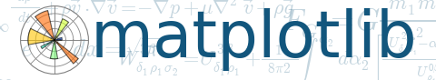

##################################################################
Implementacja filtra antyspamowego przy użyciu uczenia maszynowego
##################################################################

:Autor: Mariusz Okulanis
:Promotor: dr inż. Michał Bereta

.. include:: <s5defs.txt>

Wstęp
=====

Założeniem pracy jest stworzenie filtra antyspamowego,
który będzie klasyfikował spam korzystając z
uczenia maszynowego oraz
który będzie mógł zostać wykorzystany w istniejących
programach pocztowych.

Cel i zakres pracy
==================

* Opracowanie sposobu ekstrakcji istotnych informacji z
  wiadomości e-mail
* Przetestowanie różnych algorytmów klasyfikujących i
  optymalizacja ich parametrów
* Porównanie skuteczności algorytmów
* Integracja z programem pocztowym

Uczenie maszynowe
=================

Uczenie maszynowe jest dziedziną sztucznej inteligencji.
Polega na tworzeniu automatycznych
systemów potrafiących się doskonalić przy pomocy zdobytego
doświadczenia i nabywania w ten sposób nowej wiedzy.

.. container:: incremental

    Przykładowe zastosowania:

    * rozpoznawanie mowy
    * automatyczne sterowanie samochodem

Przetwarzanie wiadomości
========================

* Oddzielenie nagłówków od ciała wiadomości
* Zdekodowanie ciała wiadomości i odczytanie jej
  przy pomocy odpowiedniej strony kodowej
* Przetworzenie wiadomości w formacie HTML na prosty tekst
* Obsługa wiadomości wieloczęściowych

Ważne cechy wiadomości
======================

* Częstość wystąpień słów

.. code::
   :class: incremental

    receive     0.676
    please      1.018
    we          1.864
    money       1.112
    will        1.784
    free        1.498
    our         1.662
    your        4.002
    you         7.396

Ważne cechy wiadomości
======================

* Częstość wystąpień słów

.. class:: incremental

* Wystąpenia linków w treści e-maila

.. class:: incremental

* Pokrycie tekstu pogrubieniami i kolorami

Algorytmy uczenia maszynowego
=============================

Wybrane algorytmy:

* Regresja logistyczna
* Maszyna wektorów nośnych (SVM)
* Naiwny klasyfikator bayesowski
* Las drzew losowych

Regresja logistyczna
====================

.. figure:: charts/ROC_LogisticRegression.png
   :align: center

   Krzywa ROC, Celność: 97,4%

Maszyna wektorów nośnych (SVM)
==============================

.. figure:: charts/ROC_SVC.png
   :align: center

   Krzywa ROC, Celność: 84,8%

Naiwny klasyfikator bayesowski
==============================

.. figure:: charts/ROC_MultinomialNB.png
   :align: center

   Krzywa ROC, Celność: 96,2%

Las drzew losowych
==================

.. figure:: charts/ROC_RandomForestClassifier.png
   :align: center

   Krzywa ROC, Celność: 96,0%

Porówanie
=========

.. image:: charts/ROC_ALL.png
   :align: center

Integracja z klientem poczty
============================

Architektura:

* Filtr antyspamowy nasłuchuje żądań HTTP
* Żądania zawierają surową treść maili do sprawdzenia
* Serwer odpowiada swoimi przewidywaniami

Integracja z klientem poczty
============================

.. image:: images/plugin1_c.png
   :width: 80%
   :align: center

Integracja z klientem poczty
============================

.. image:: images/plugin2_c.png
   :width: 80%
   :align: center

Wykorzystane technologie
========================

* Python
* Scipy
* Pandas
* Matplotlib

|python| |matplotlib| |scipy| |pandas|

.. |scipy| image:: logos/scipy.png
.. |pandas| image:: logos/pandas.png
.. |python| image:: logos/python.png
   :scale: 50%

Koniec
======

.. class:: center huge

Dziękuję za uwage
