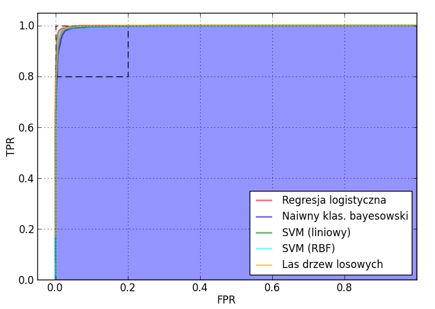
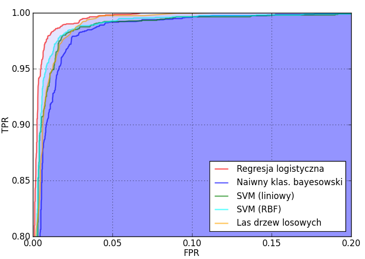

##################################################################
Implementacja filtra antyspamowego przy użyciu uczenia maszynowego
##################################################################

:Autor: Mariusz Okulanis
:Promotor: dr inż. Michał Bereta

Wstęp
=====

Założeniem pracy jest stworzenie filtra antyspamowego,
który klasyfikuje spam korzystając z
uczenia maszynowego. Ponadto filtr ten będzie posiadał
interfejs, który pozwoli na integracje z istniejącymi
programami pocztowymi.

Cel i zakres pracy
==================

* Opracowanie sposobu ekstrakcji istotnych informacji z
  wiadomości e-mail
* Przetestowanie różnych algorytmów klasyfikujących i
  optymalizacja ich parametrów
* Porównanie skuteczności algorytmów
* Integracja z programem pocztowym

Uczenie maszynowe
=================

Uczenie maszynowe jest dziedziną sztucznej inteligencji.
Polega na tworzeniu automatycznych
systemów potrafiących się doskonalić przy pomocy zdobytego
doświadczenia i nabywania w ten sposób nowej wiedzy.

Przykładowe zastosowania:

* rozpoznawanie mowy
* automatyczne sterowanie samochodem

Przetwarzanie wiadomości
========================

* Oddzielenie nagłówków od ciała wiadomości
* Zdekodowanie ciała wiadomości i odczytanie jej
  przy pomocy odpowiedniej strony kodowej
* Przetworzenie wiadomości w formacie HTML na prosty tekst
* Obsługa wiadomości wieloczęściowych

Ważne cechy wiadomości
======================

* Częstość wystąpień słów

======= ========= ========
Słowo   Spam      Nie-spam
======= ========= ========
you      7.469347 2.184469
your     4.638102 0.883071
our      1.876071 0.415055
we       2.082399 0.783100
free     1.482531 0.287414
will     1.858932 0.713776
click    1.052076 0.119012
please   1.021753 0.173758
======= ========= ========

Ważne cechy wiadomości
======================

* Częstość wystąpień słów
* Wystąpienia linków w treści e-maila
* Pokrycie tekstu pogrubieniami i kolorami

Algorytmy uczenia maszynowego
=============================

Wybrane algorytmy:

* Regresja logistyczna
* Naiwny klasyfikator bayesowski
* Maszyna wektorów nośnych (SVM)
* Las drzew losowych

Porówanie efektywności algorytmów
=================================

======================= ========= =========== ===========
Algorytm                Średnie   Odchylenie  TPR dla    
                        AUC       standardowe FPR ~ 0.03 
                                  AUC                    
======================= ========= =========== ===========
Regresja logistyczna    0.99883   0.00058     0.99352    
Naiwny klas. bayesowski 0.99621   0.00105     0.98254   
SVM (liniowy)           0.99677   0.00043     0.98734    
SVM (RBF)               0.99679   0.00026     0.98839    
Las drzew losowych      0.99774   0.00044     0.98892    
======================= ========= =========== ===========

Porówanie efektywności algorytmów
=================================

Porówanie efektywności algorytmów
=================================

Integracja z klientem poczty
============================

Architektura:

* Filtr antyspamowy nasłuchuje żądań HTTP
* Żądania zawierają surową treść maili do sprawdzenia
* Serwer odpowiada swoimi przewidywaniami

Integracja z klientem poczty
============================

.. image:: images/plugin1_c.png
   :width: 80%
   :align: center

Integracja z klientem poczty
============================

.. image:: images/plugin2_c.png
   :width: 80%
   :align: center

..
    Wykorzystane technologie
    ========================

    + Python
    + Scipy
    + Pandas
    + Matplotlib

    |python| |matplotlib| |scipy| |pandas|

   .. |matplotlib| image:: logos/matplotlib.png
      :scale: 30%
   .. |scipy| image:: logos/scipy.png
      :scale: 30%
   .. |pandas| image:: logos/pandas.png
      :scale: 30%
   .. |python| image:: logos/python.png
      :scale: 30%

Koniec
======

.. class:: center

Dziękuję za uwagę
